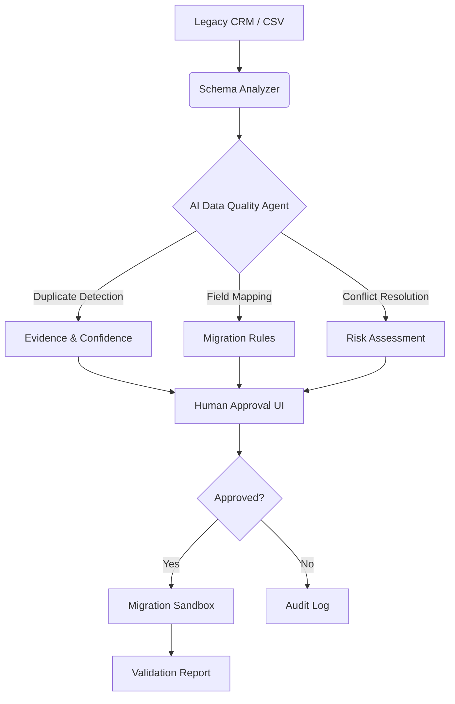

# Enterprise Data Migration Platform

An enterprise-grade AI platform that automates legacy CRM modernization with human-in-the-loop oversight. This system addresses the critical challenge of migrating dirty, inconsistent data from legacy systems to modern platforms while maintaining auditability and control.

## Problem Statement

Enterprise organizations face significant challenges when modernizing legacy CRM systems:
- **Data Quality Issues**: Duplicates, missing fields, inconsistent formats, and conflicting records
- **Migration Risk**: Direct AI-driven changes can introduce errors without human oversight
- **Audit Requirements**: Enterprise environments require explainable decisions and approval workflows
- **Cost & Time**: Manual data cleaning is expensive and error-prone

## Solution

This platform combines **deterministic rules** with **AI reasoning** to:
1.  **Analyze** legacy CRM databases for quality issues
2.  **Recommend** migrations, merges, deletions with confidence scores
3.  **Explain** the evidence behind each recommendation (e.g., "Same domain + similar name = 97% match")
4.  **Require Human Approval** before executing high-risk changes
5.  **Validate** results in a sandbox environment before production deployment


## Architecture

This system analyzes legacy CRM databases, identifies data-quality problems, recommends migrations/merges/deletions, explains its reasoning, and lets a human approve changes before execution.



## Features (Phase 1)

- **Synthetic Data Generation**: Creates realistic dirty CRM datasets with intentional duplicates, missing fields, and invalid formats.
- **Data Quality Analysis**: Automated profiling of CSV/DB records to identify issues.
- **Containerized Infrastructure**: Docker Compose setup for isolated backend and PostgreSQL database.
- **FastAPI Backend**: RESTful API endpoints for data generation and quality reporting.

## Tech Stack

| Component | Technology | Why It Matters |
|-----------|------------|----------------|
| **Backend** | Python 3.12 + FastAPI | Production-ready async framework with auto-generated docs |
| **Database** | PostgreSQL (Docker) | Enterprise-grade relational database for structured data |
| **Containerization** | Docker Compose | Reproducible environments, easy deployment |
| **Data Generation** | Faker Library | Realistic synthetic data for testing without PII concerns |
| **Analysis** | Pandas + Standard Library | Efficient data processing and quality metrics |

## Quick Start

### Prerequisites
- [Docker Desktop](https://www.docker.com/products/docker-desktop/) installed and running.
- Git installed on your system.

### Installation & Run

```bash
# Clone repository
git clone https://github.com/DKMirza/enterprise-data-agent.git
cd enterprise-data-agent

# Build and run containers
docker compose up --build

# Generate synthetic data (POST request)
curl -X POST http://localhost:8000/generate-synthetic-data

# Get quality report (GET request)
curl http://localhost:8000/quality-report
```

## API Documentation

Once running, visit the auto-generated Swagger UI at http://localhost:8000/docs

## Project Status

| Phase | Description | Status |
|-----------|------------|------------|
| **1** | Data Engine & Synthetic Generation | ✅ |
| **2** | AI Analysis (LLM Duplicate Detection) | ⏳ |
| **3** | Entity Resolution (Fuzzy Matching + AI)	 | 🔜 |
| **4** | Human Approval UI (React Frontend) | 🔜 |
| **5** | Migration Simulator & Sandbox | 🔜 |
| **6** | Production Engineering (CI/CD, Tests) | 🔜 |
