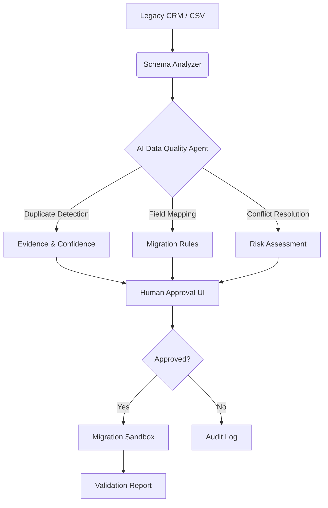

# Enterprise Data Migration Platform

An enterprise-grade AI platform that automates legacy CRM modernization with human-in-the-loop oversight. This system addresses the critical challenge of migrating dirty, inconsistent data from legacy systems to modern platforms while maintaining auditability and control.

## Problem Statement

Enterprise organizations face significant challenges when modernizing legacy CRM systems:
- **Data Quality Issues**: Duplicates, missing fields, inconsistent formats, and conflicting records
- **Migration Risk**: Direct AI-driven changes can introduce errors without human oversight
- **Audit Requirements**: Enterprise environments require explainable decisions and approval workflows
- **Cost & Time**: Manual data cleaning is expensive and error-prone

## Solution

This platform combines **deterministic rules** with **AI reasoning** to:
1.  **Analyze** legacy CRM databases for quality issues
2.  **Recommend** migrations, merges, deletions with confidence scores
3.  **Explain** the evidence behind each recommendation (e.g., "Same domain + similar name = 97% match")
4.  **Require Human Approval** before executing high-risk changes
5.  **Validate** results in a sandbox environment before production deployment


## Architecture

This system analyzes legacy CRM databases, identifies data-quality problems, recommends migrations/merges/deletions, explains its reasoning, and lets a human approve changes before execution.



## Features (Phase 1)

- **Synthetic Data Generation**: Creates realistic dirty CRM datasets with intentional duplicates, missing fields, and invalid formats.
- **Data Quality Analysis**: Automated profiling of CSV/DB records to identify issues.
- **Containerized Infrastructure**: Docker Compose setup for isolated backend and PostgreSQL database.
- **FastAPI Backend**: RESTful API endpoints for data generation and quality reporting.

## Features (Phase 2)

- **AI-Powered Duplicate Detection**: Identifies duplicate records using domain-based blocking and weighted confidence scoring.
- **Risk Level Classification**: Categorizes duplicates as LOW (auto-merge), MEDIUM (review required), or HIGH (investigate).
- **Evidence-Based Recommendations**: Each recommendation includes specific reasons (e.g., "Same website domain", "97% name match").
- **NaN Handling**: Robust handling of missing values from CSV data.

## Features (Phase 3)

- **Entity Resolution Service**: Advanced AI-powered record linkage using fuzzy matching algorithms
- **Batch Entity Resolution** (`/resolve-entities`): Find all potential duplicate pairs in a dataset with confidence scoring
- **Single Record Lookup** (`/find-best-match`): Find the best matching record for a query against candidate records
- **Multi-Field Similarity Analysis**: Compares name, domain, industry, address, phone using weighted algorithms
- **Confidence Thresholds**: 
  - HIGH (≥0.90): AUTO_MERGE - Safe to merge automatically
  - MEDIUM (0.75-0.89): REVIEW_REQUIRED - Manual review recommended
  - LOW (0.60-0.74): INVESTIGATE - Low confidence, investigate further

## Tech Stack

| Component | Technology | Why It Matters |
|-----------|------------|----------------|
| **Backend** | Python 3.12 + FastAPI | Production-ready async framework with auto-generated docs |
| **Database** | PostgreSQL (Docker) | Enterprise-grade relational database for structured data |
| **Containerization** | Docker Compose | Reproducible environments, easy deployment |
| **Data Generation** | Faker Library | Realistic synthetic data for testing without PII concerns |
| **Analysis** | Pandas + Standard Library | Efficient data processing and quality metrics |

## Quick Start

### Prerequisites
- [Docker Desktop](https://www.docker.com/products/docker-desktop/) installed and running.
- Git installed on your system.

### Installation & Run

```bash
# Clone repository
git clone https://github.com/DKMirza/enterprise-data-agent.git
cd enterprise-data-agent

# Build and run containers
docker compose up --build

# Generate synthetic data (POST request)
Invoke-WebRequest -Uri "http://localhost:8000/generate-synthetic-data" -Method POST

# Get quality report (GET request)
curl http://localhost:8000/quality-report

# Detect duplicates with AI (POST request)
Invoke-WebRequest -Uri "http://localhost:8000/detect-duplicates" -Method POST | Select-Object -ExpandProperty Content | ConvertFrom-Json
```

## API Documentation

Once running, visit the auto-generated Swagger UI at http://localhost:8000/docs

### Entity Resolution API Endpoints (Phase 3)

#### POST /resolve-entities

**Description**: Batch entity resolution for multiple records using AI-powered record linkage. This endpoint identifies all potential duplicate pairs in a dataset with confidence scores and risk assessments.

**Request Body**:
```json
{
  "records": [
    {
      "id": "R1",
      "name": "Acme Corp",
      "domain": "acme.com",
      "industry": "Technology",
      "address": "123 Main St, San Francisco, CA",
      "phone": "+1-415-555-0100"
    },
    {
      "id": "R2",
      "name": "Acme Corporation",
      "domain": "acme.com",
      "industry": "Tech",
      "address": "123 Main Street, San Francisco, CA 94105",
      "phone": "+1-415-555-0100"
    }
  ],
  "min_confidence": 0.75
}
```

**Response**: Returns top 20 match recommendations with confidence scores, risk levels, and evidence.

**Example Request**:
```bash
curl -X POST "http://localhost:8000/resolve-entities" \
  -H "Content-Type: application/json" \
  -d '{
    "records": [
      {"id": "R1", "name": "Acme Corp", "domain": "acme.com"},
      {"id": "R2", "name": "Acme Corporation", "domain": "acme.com"}
    ],
    "min_confidence": 0.75
  }'
```

**Example Response**:
```json
{
  "total_matches": 1,
  "summary": {
    "by_risk_level": {"LOW": 1, "MEDIUM": 0, "HIGH": 0},
    "by_action": {"AUTO_MERGE": 1},
    "avg_confidence": 0.944
  },
  "recommendations": [
    {
      "record_1_id": "R1",
      "record_2_id": "R2",
      "confidence": 0.944,
      "risk_level": "LOW",
      "action": "AUTO_MERGE",
      "evidence": [
        {"type": "DOMAIN_MATCH", "score": 1.0, "details": "Same domain: acme.com"},
        {"type": "PHONE_MATCH", "score": 1.0, "details": "Same phone number"}
      ]
    }
  ]
}
```

---

#### POST /find-best-match

**Description**: Find the best matching record for a single query against candidate records. Useful for real-time duplicate checking during data entry or finding canonical entities.

**Request Body**:
```json
{
  "target_record": {
    "id": "Q1",
    "name": "Acme Corp Inc",
    "domain": "acme.com",
    "industry": "Technology"
  },
  "candidate_records": [
    {
      "id": "C1",
      "name": "Acme Corporation",
      "domain": "acme.com",
      "industry": "Tech"
    }
  ],
  "threshold": 0.85
}
```

**Response**: Best match details including confidence score, similarity breakdown, and recommended action.

**Example Request**:
```bash
curl -X POST "http://localhost:8000/find-best-match" \
  -H "Content-Type: application/json" \
  -d '{
    "target_record": {"id": "Q1", "name": "Acme Corp Inc", "domain": "acme.com"},
    "candidate_records": [
      {"id": "C1", "name": "Acme Corporation", "domain": "acme.com"}
    ],
    "threshold": 0.85
  }'
```

**Example Response**:
```json
{
  "match_found": true,
  "best_match": {
    "candidate_id": "C1",
    "confidence": 1.0,
    "evidence": [
      {"type": "DOMAIN_MATCH", "score": 1.0, "details": "Same domain: acme.com"}
    ],
    "risk_level": "LOW",
    "action": "AUTO_MERGE"
  },
  "message": "Match found with 100.0% confidence. Recommended action: AUTO_MERGE"
}
```

---

### Confidence Thresholds & Actions

| Confidence Range | Risk Level | Action | Description |
|-----------------|------------|--------|-------------|
| ≥ 0.90 | LOW | AUTO_MERGE | Records are highly likely duplicates, safe to merge automatically |
| 0.75 - 0.89 | MEDIUM | REVIEW_REQUIRED | Manual review recommended before merging |
| 0.60 - 0.74 | HIGH | INVESTIGATE | Low confidence match, investigate further |

### Algorithm Weights

The entity resolution algorithm uses the following field weights:
- **Name Similarity**: 35% (fuzzy string matching)
- **Domain Match**: 25% (exact email domain comparison)
- **Industry Similarity**: 15% (semantic similarity)
- **Address Similarity**: 10% (normalized address comparison)
- **Phone Similarity**: 10% (formatted phone number match)
- **Email Domain Match**: 5% (email domain consistency)

---

### Existing Endpoints (Phase 1 & 2)

#### POST /generate-synthetic-data
Generates synthetic dirty CRM data for testing.

```bash
curl -X POST "http://localhost:8000/generate-synthetic-data" \
  -H "Content-Type: application/json" \
  -d '{"num_records": 100}'
```

#### GET /quality-report
Returns a data quality analysis report.

```bash
curl http://localhost:8000/quality-report
```

#### POST /detect-duplicates
AI-powered duplicate detection with confidence scoring (Phase 2).

```bash
curl -X POST "http://localhost:8000/detect-duplicates" \
  -H "Content-Type: application/json" \
  -d '{}'
```

## Project Status

| Phase | Description | Status |
|-----------|------------|------------|
| **1** | Data Engine & Synthetic Generation | ✅ Complete |
| **2** | AI Analysis (LLM Duplicate Detection) | ✅ Complete |
| **3** | Entity Resolution (Fuzzy Matching + AI)  | ✅ Complete |
| **4** | Human Approval UI (React Frontend) | 🔜 Pending |
| **5** | Migration Simulator & Sandbox | 🔜 Pending |
| **6** | Production Engineering (CI/CD, Tests) | 🔜 Pending |
